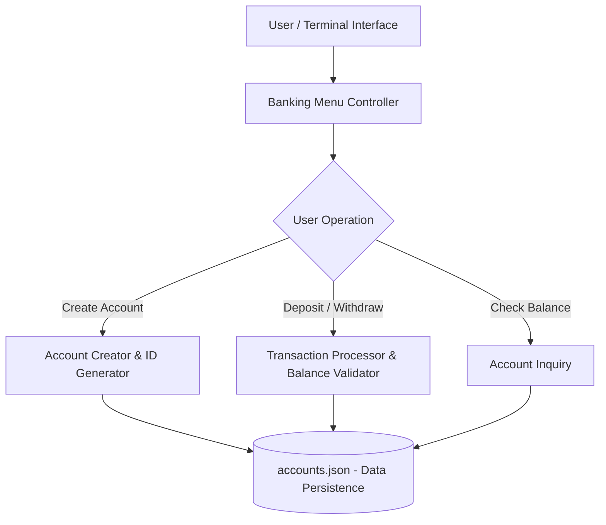

# Python Banking Management System 🏦

An Object-Oriented Programming (OOP) based terminal banking system built with Python, featuring account management, real-time transaction processing, and JSON-based persistent storage.

---

## ✨ Features
* **Account Creation & Management:** Create unique bank accounts with initial balance setup.
* **Core Banking Transactions:** Deposit funds, withdraw with real-time balance validation, and check account balances.
* **Persistent Storage:** Saves account data and transaction states securely in a local `accounts.json` file.
* **Robust OOP Design:** Implements clean classes, methods, and encapsulation principles for maintainable code.
* **Interactive CLI:** User-friendly menu-driven interface with input validation.

---

## 🛠️ Tech Stack
* **Language:** Python 3.8+
* **Data Storage:** JSON (File-based storage)
* **Paradigm:** Object-Oriented Programming (OOP)

---

## 🚀 Quick Start

1. **Clone the Repository**
   ```bash
   git clone https://github.com/satyanarayana51115/py_bank_project.git
   cd py_bank_project
   ```

2. **Run the Application**
   *(No external pip dependencies required - runs directly on pure Python standard library)*
   ```bash
   python bank_account.py
   ```

3. **Follow the Menu Prompts**
   Select the desired banking operation (Create Account, Deposit, Withdraw, Check Balance, Exit) directly in your terminal.

---

## 🔁 System Architecture & Workflow



---

## 👨‍💻 Author
**Satyanarayana** - [@satyanarayana51115] https://github.com/satyanarayana51115
